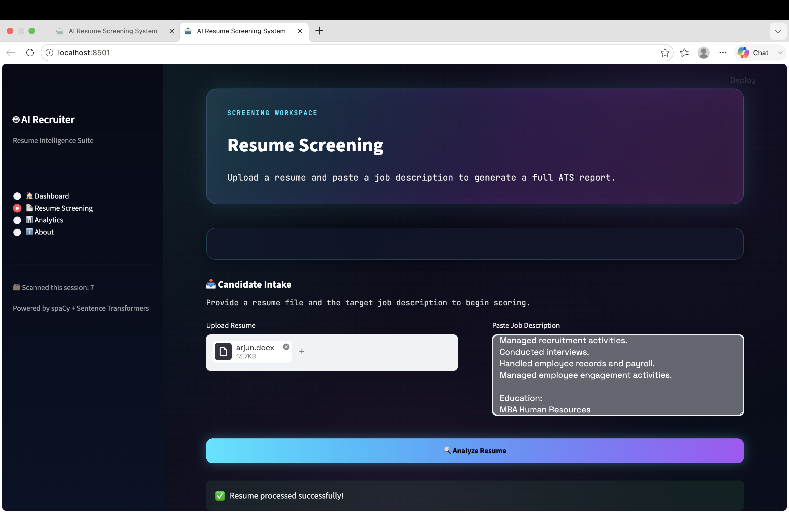
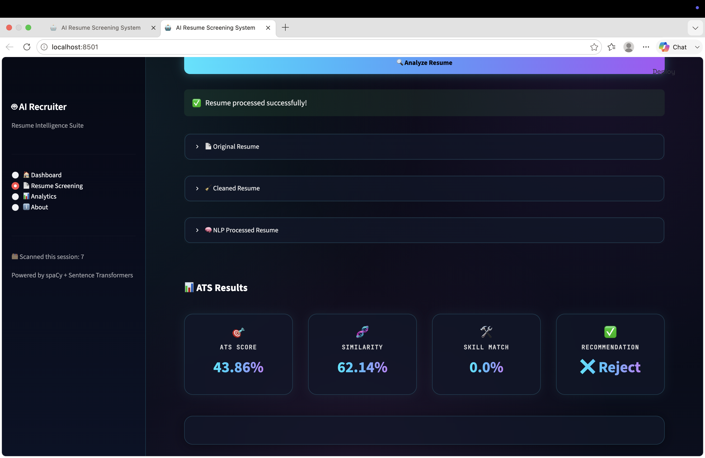
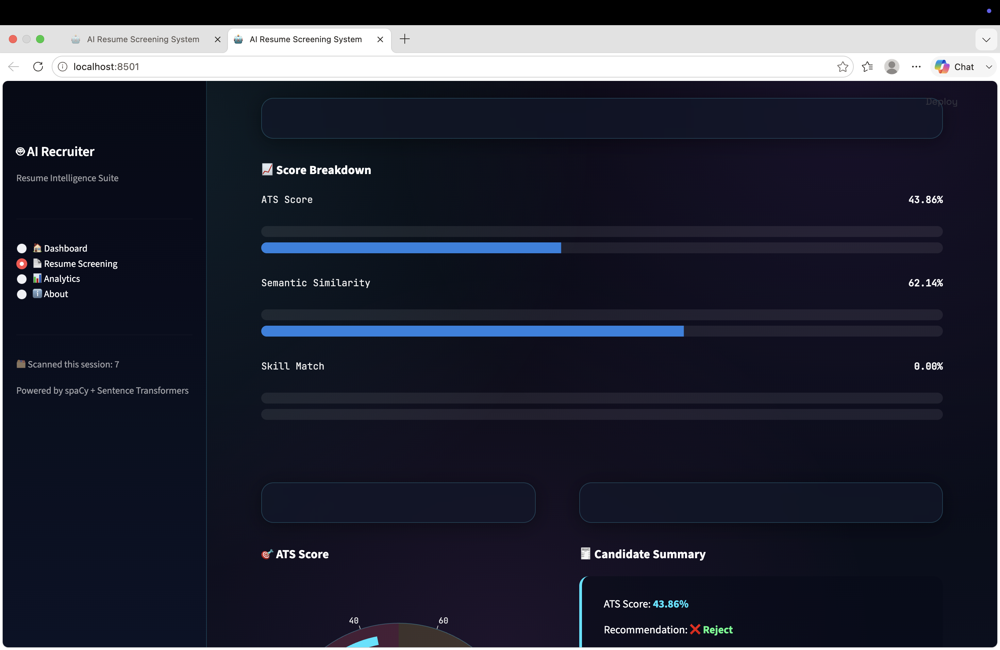
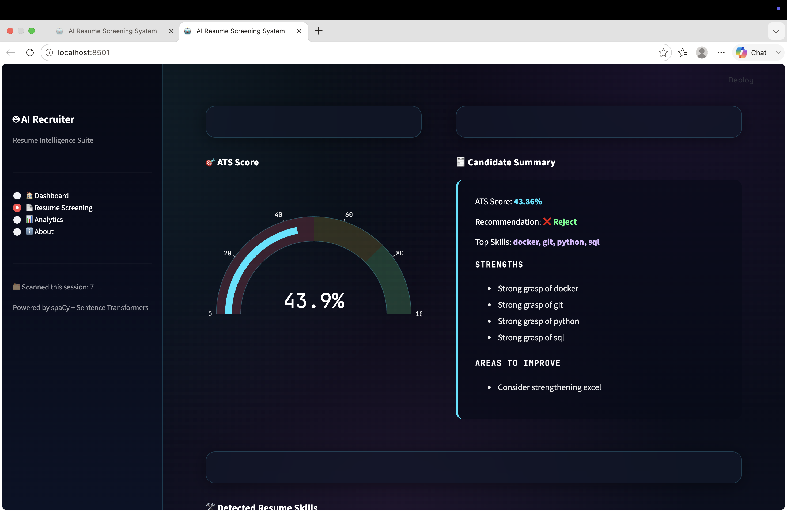
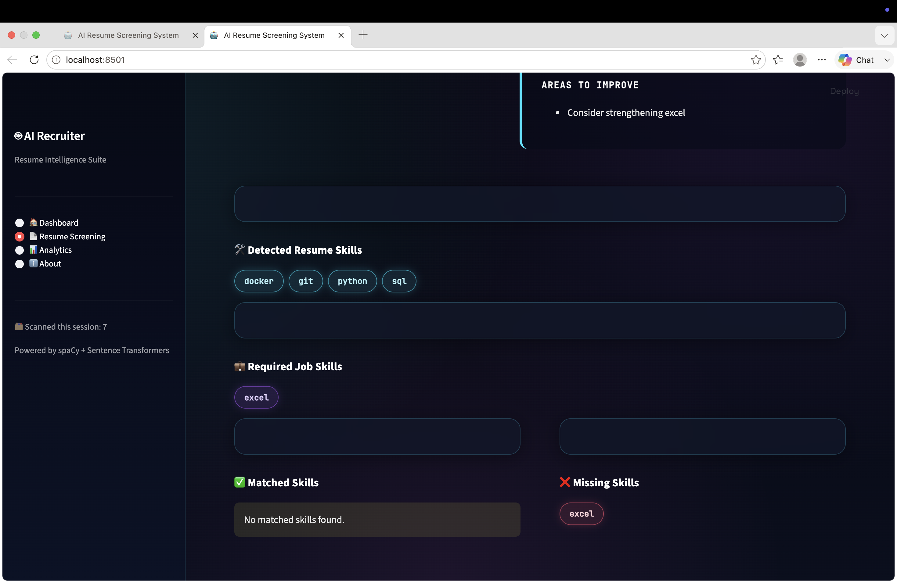
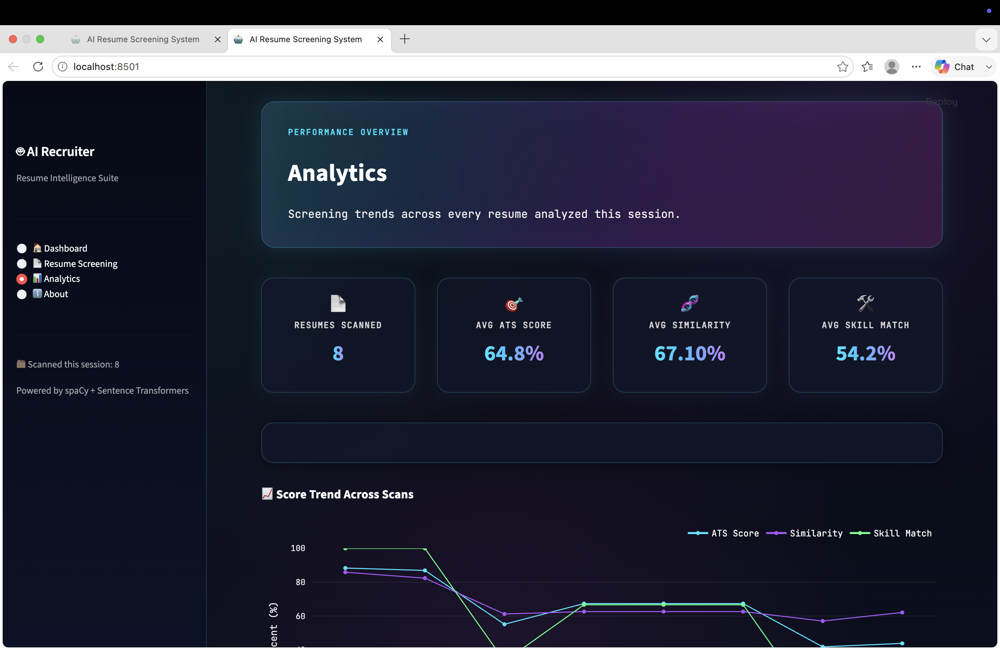
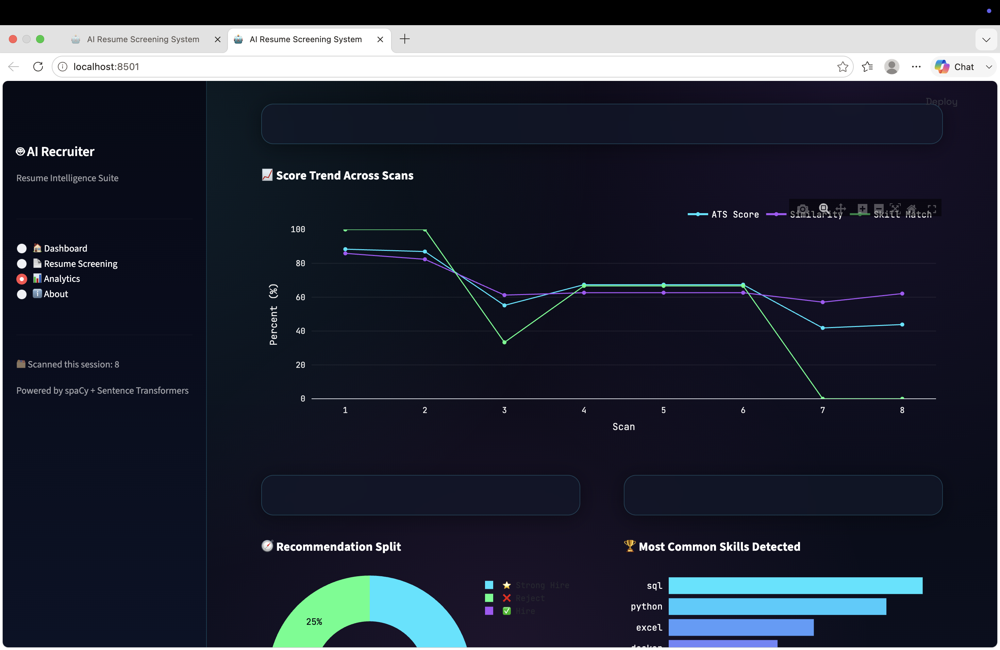
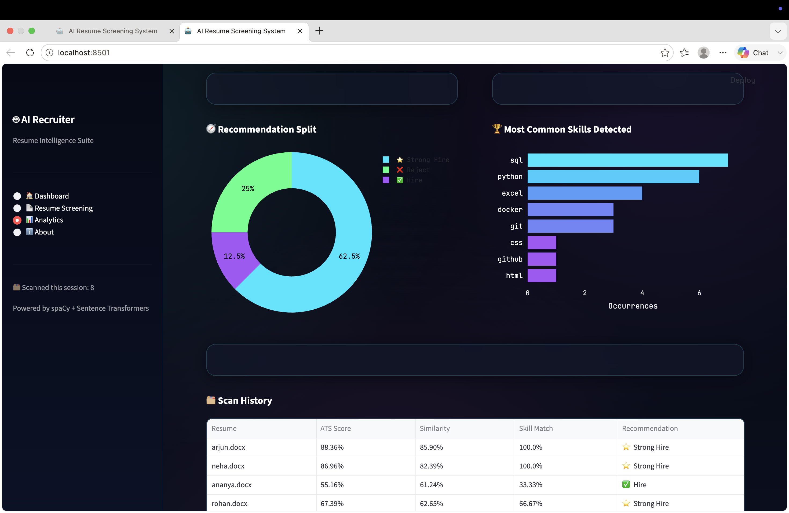
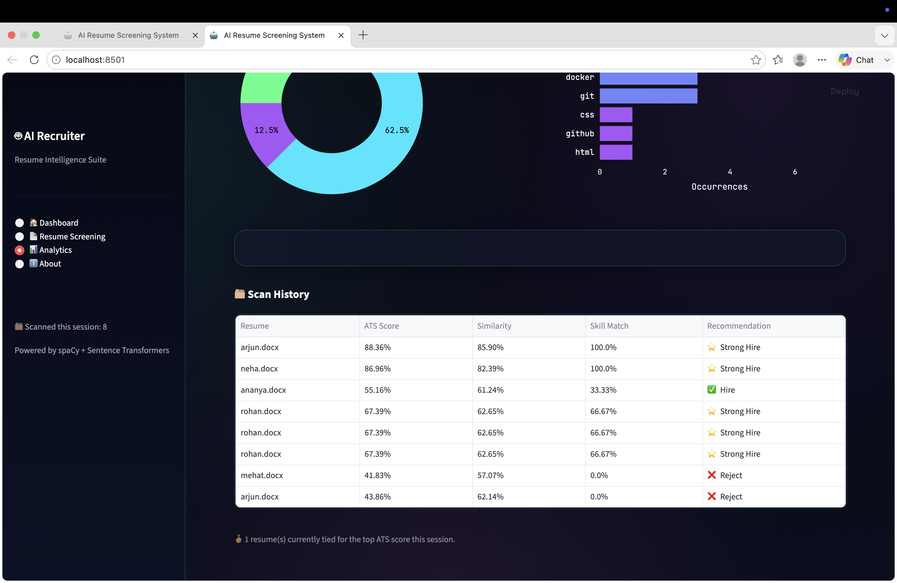

# 🤖 AI Resume Screening System

An AI-powered resume screening and candidate evaluation system that helps recruiters analyze resumes against job descriptions using Natural Language Processing, semantic similarity, skill matching, and ATS-based scoring.

The application provides an interactive Streamlit interface for uploading resumes, entering job descriptions, evaluating candidates, and viewing screening analytics.

---

## 📌 Overview

Recruiters often need to review a large number of resumes for a single position. Manually comparing resumes with job requirements can be time-consuming and inconsistent.

The **AI Resume Screening System** automates the initial screening process by combining:

- 📄 Resume text extraction
- 🧹 NLP-based preprocessing
- 🛠️ Skill extraction
- 🧠 Semantic similarity
- 🎯 Skill matching
- 📊 ATS scoring
- ⭐ Candidate recommendations
- 📈 Screening analytics

The system is designed as a **recruitment decision-support tool** that helps recruiters quickly identify candidates whose resumes are most relevant to a given job description.

---

## ✨ Features

### 📄 Resume Screening

- Upload resumes in **PDF, DOCX, or TXT** format
- Extract resume text automatically
- Clean and preprocess resume content
- View original resume text
- View cleaned resume text
- View NLP-processed resume text
- Automatically detect technical skills
- Display required job skills
- Compare candidate skills against job requirements

### 🧠 NLP & Machine Learning

- Natural Language Processing using **spaCy**
- Resume text preprocessing
- Automated skill extraction
- Semantic embeddings using **BGE-small-en-v1.5**
- Cosine similarity between resumes and job descriptions
- Skill-based matching

### 📊 ATS Scoring

The system calculates an ATS score using multiple candidate evaluation signals:

- Semantic Similarity
- Skill Match
- Experience Match
- Education Match
- Resume Completeness

### 🎯 Candidate Recommendations

Candidates are categorized based on their ATS score:

| ATS Score | Recommendation |
|-----------|----------------|
| `60+` | ⭐ Strong Hire |
| `50–59.99` | ✅ Hire |
| `40–49.99` | ⚠️ Consider |
| `<40` | ❌ Reject |

### 📈 Analytics Dashboard

The analytics dashboard provides an overview of screening activity during the current session.

It includes:

- Number of resumes scanned
- Average ATS score
- Average semantic similarity
- Average skill match
- Score trends
- Recommendation distribution
- Most commonly detected skills
- Resume screening history

---

# 🧠 Machine Learning Pipeline

The system follows an end-to-end resume screening pipeline:

```text
                         Resume
                           │
                           ▼
                 ┌──────────────────┐
                 │ Text Extraction  │
                 └────────┬─────────┘
                          │
                          ▼
                 ┌──────────────────┐
                 │ NLP Preprocessing│
                 └────────┬─────────┘
                          │
                          ▼
                 ┌──────────────────┐
                 │ Skill Extraction │
                 └────────┬─────────┘
                          │
                          ▼
                 ┌──────────────────┐
                 │ BGE Embeddings   │
                 └────────┬─────────┘
                          │
                          ▼
                 ┌──────────────────┐
                 │ Cosine Similarity│
                 └────────┬─────────┘
                          │
                          ▼
                 ┌──────────────────┐
                 │ Skill Matching   │
                 └────────┬─────────┘
                          │
                          ▼
                 ┌──────────────────┐
                 │   ATS Scoring    │
                 └────────┬─────────┘
                          │
                          ▼
                 ┌──────────────────┐
                 │ Recommendation   │
                 └──────────────────┘
```

---

# 🔍 Screening Workflow

A typical candidate screening process works as follows:

```text
1. Upload Resume
        ↓
2. Enter Job Description
        ↓
3. Extract Resume Text
        ↓
4. Clean Resume Text
        ↓
5. NLP Preprocessing
        ↓
6. Extract Resume Skills
        ↓
7. Generate BGE Embeddings
        ↓
8. Calculate Semantic Similarity
        ↓
9. Calculate Skill Match
        ↓
10. Calculate ATS Score
        ↓
11. Generate Recommendation
        ↓
12. Display Results & Analytics
```

---

# 📊 ATS Score Calculation

The ATS score combines multiple screening signals:

```text
ATS Score =

40% × Semantic Similarity
+
35% × Skill Match
+
10% × Experience Match
+
5% × Education Match
+
10% × Resume Completeness
```

The resulting score is used to generate a candidate recommendation.

---

# 🛠️ Tech Stack

### Programming

- Python

### Application Framework

- Streamlit

### Natural Language Processing

- spaCy
- Sentence Transformers

### Machine Learning

- BGE-small-en-v1.5
- Scikit-learn
- Cosine Similarity

### Data Processing

- Pandas
- NumPy

### Visualization

- Plotly

### Development Tools

- Jupyter Notebook
- Git
- GitHub

---

# 📂 Project Structure

```text
FUTURE_ML_03/
│
├── app.py
├── requirements.txt
├── .gitignore
│
├── backend/
│   ├── __init__.py
│   ├── ats_engine.py
│   ├── ml_pipeline.py
│   ├── parser.py
│   ├── preprocessing.py
│   └── skill_extractor.py
│
├── data/
│   ├── job_descriptions/
│   └── resumes/
│
├── models/
│
├── notebooks/
│   └── Resume_Screening_System.ipynb
│
└── screenshots/
    ├── dashboard.png
    ├── resume-screening.png
    ├── analytics.png
    └── about.png
```

---

# 📸 Application Screenshots

## 🏠 Dashboard

The dashboard provides an overview of the AI Resume Screening System, its core capabilities, and the technologies used.


---

## 📄 Resume Screening

The Resume Screening module allows recruiters to upload a resume and provide a job description for analysis.

### Resume Processing



### ATS Results



### Score Breakdown



### Candidate Summary



### Skill Matching



---

## 📊 Analytics

The Analytics dashboard provides insights into screening activity, candidate scores, recommendations, and detected skills.

### Analytics Overview



### Score Trends



### Recommendation Distribution



### Screening History



---

## ℹ️ About

The About section provides an overview of the system and the technologies used to build it.


---

# ⚙️ Installation & Setup

## 1. Clone the Repository

```bash
git clone https://github.com/Dikshitha-Rasineni/FUTURE_ML_03.git
```

## 2. Navigate to the Project

```bash
cd FUTURE_ML_03
```

## 3. Create a Virtual Environment

### macOS / Linux

```bash
python3 -m venv .venv
source .venv/bin/activate
```

### Windows

```bash
python -m venv .venv
.venv\Scripts\activate
```

## 4. Install Dependencies

```bash
pip install -r requirements.txt
```

## 5. Run the Application

```bash
streamlit run app.py
```

The application will open through the Streamlit local development server.

---

# 🎯 Project Objective

The main objective of this project is to develop an intelligent resume screening system that can:

- Reduce the time required for initial resume screening
- Identify relevant candidate skills
- Compare resumes with job requirements
- Measure semantic similarity between resumes and job descriptions
- Generate a structured ATS score
- Provide candidate recommendations
- Present screening insights through an interactive dashboard

The system is intended to assist recruiters in the **initial candidate screening process** while keeping the final hiring decision with a human recruiter.

---

# 📈 Example Evaluation

The system can identify different levels of candidate-job compatibility.

### Strong Match

A candidate with most of the required technical skills and strong semantic similarity can receive a high ATS score and a:

> ⭐ Strong Hire

### Partial Match

A candidate with some relevant skills but several missing requirements can receive a moderate ATS score and a:

> ⚠️ Consider

### Weak Match

A candidate whose resume has limited overlap with the job requirements can receive a lower ATS score.

### Poor Match

A candidate with very little overlap with the required skills and job description can receive:

> ❌ Reject

This allows the system to distinguish between strong, partial, weak, and poor candidate matches.

---

# 🔮 Future Improvements

Potential future enhancements include:

- Multi-resume batch screening
- Candidate ranking across multiple resumes
- Improved experience extraction
- Improved education matching
- Resume-to-job explainability
- Persistent candidate database
- Exportable screening reports
- Bias and fairness monitoring
- Cloud deployment
- Integration with existing Applicant Tracking Systems
- Recruiter authentication
- Role-based access control

---

# 📌 Project Status

**Status: Completed Prototype**

The current system includes:

- ✅ Resume upload
- ✅ Resume text extraction
- ✅ NLP preprocessing
- ✅ Skill extraction
- ✅ Semantic similarity
- ✅ Skill matching
- ✅ ATS scoring
- ✅ Candidate recommendations
- ✅ Streamlit dashboard
- ✅ Analytics dashboard
- ✅ Screening history

---

# 👩‍💻 Author

**Dikshitha Rasineni**

B.Tech — Computer Science & Engineering  
Specialization in Artificial Intelligence & Machine Learning

---

# 📄 License

This project was developed for educational and internship purposes.
